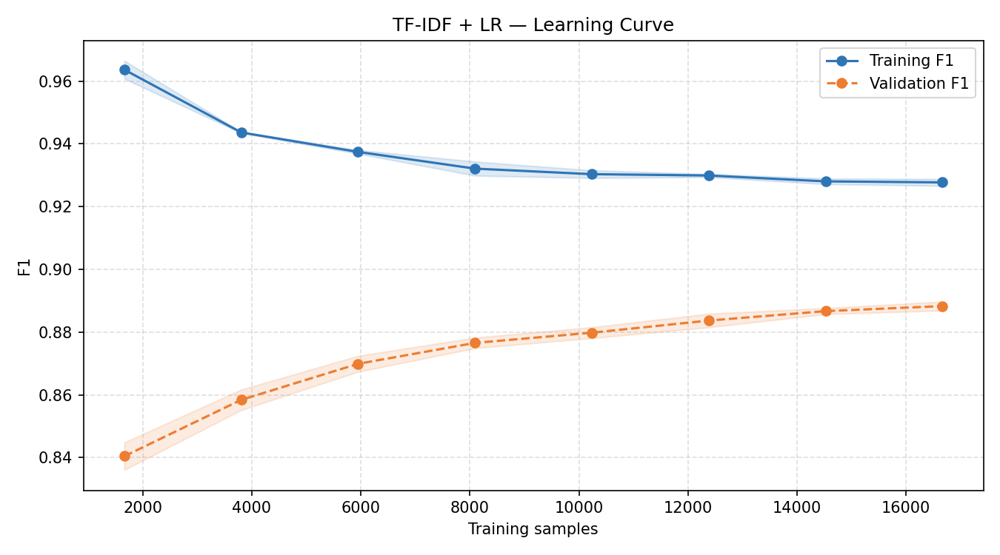
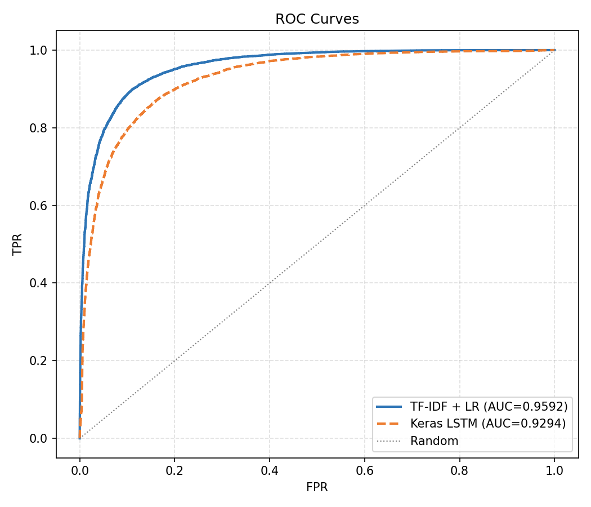
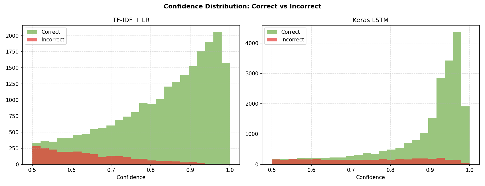

# IMDb Sentiment Analysis: Benchmarking Classical NLP, Deep Learning, and Foundation Models on AWS


A production sentiment analysis pipeline that trains and benchmarks two approaches on 50,000 IMDb reviews — classical NLP (TF-IDF + Logistic Regression) and deep learning (Keras LSTM) — then deploys the winning model as a serverless REST API on AWS Lambda. **TF-IDF + Logistic Regression wins** (F1 = 0.8945 vs 0.8412), demonstrating that a well-tuned classical baseline can outperform a deep learning model on structured, lexically-rich text. The notebook also documents an Amazon Bedrock integration for zero-shot inference with Claude Haiku as a third benchmark dimension, and to gain hands-on experience with the Bedrock platform — navigating model access, IAM permissions, and the `boto3` API in a real AWS environment.

**Live demo → [AWS Lambda endpoint](https://5llpfbqfph.execute-api.eu-west-1.amazonaws.com)** — LR model only (`/analyze` + `/compare`)
&nbsp;&nbsp;&nbsp;&nbsp;

**Local demo → `python app.py`** — both LR and LSTM active, full `/compare` works
&nbsp;&nbsp;&nbsp;&nbsp;

**Notebook → [notebook.ipynb](notebook.ipynb)**
&nbsp;&nbsp;&nbsp;&nbsp;

**Training script → [train.py](train.py)**

---

## Table of Contents

0. [Prerequisites](#0-prerequisites)
1. [Quick start](#1-quick-start)
2. [Project structure](#2-project-structure)
3. [Dataset](#3-dataset)
4. [Models](#4-models)
5. [Results](#5-results)
6. [Visualisations](#6-visualisations)
7. [API reference](#7-api-reference)
8. [Deployment — AWS Lambda](#8-deployment--aws-lambda)
9. [Deployment constraints & alternatives](#9-deployment-constraints--alternatives)
10. [Research & technical decisions](#10-research--technical-decisions)
11. [Design decisions](#11-design-decisions)
12. [Dependencies](#12-dependencies)

---

## 0. Prerequisites

- Python 3.11+
- pip
- Docker Desktop (for Lambda deployment only)
- AWS account with access key and secret (for Lambda deployment only)

---

## 1. Quick start

**Train both models:**

```bash
pip install -r requirements.txt
python train.py
```

Training takes approximately 5–20 minutes depending on hardware (LR finishes in under a minute; LSTM trains for up to 5 epochs with early stopping).

**Run the app locally:**

```bash
python app.py
```

Visit [http://127.0.0.1:5000](http://127.0.0.1:5000) to use the demo frontend.

**Local vs live demo:**

|            | Local                 | Live (Lambda)                                |
| ---------- | --------------------- | -------------------------------------------- |
| `/analyze` | LR (best model)       | LR (best model)                              |
| `/compare` | LR + LSTM both active | LR only — LSTM returns `model not available` |

Locally, TensorFlow is installed so both models load into memory. On Lambda, TensorFlow was excluded from the deployment image to avoid cold-start timeouts (see [section 9](#9-deployment-constraints--alternatives)), so only LR is available. The `/analyze` endpoint behaves identically in both environments — it always uses the best model.

---

## 2. Project structure

```
imdb-sentiment-classifier/
├── train.py                   # Standalone training script — runs both models end to end
├── app.py                     # Flask API and frontend server
├── notebook.ipynb             # Full training walkthrough with inline outputs
├── Dockerfile                 # Container image for Lambda deployment
├── requirements.txt           # Full dependencies (training + local serving)
├── requirements-lambda.txt    # Minimal dependencies for Lambda (no TensorFlow)
├── README.md
├── .gitignore
├── templates/
│   └── index.html             # Demo frontend (no external frameworks)
├── models/
│   ├── tfidf_vectorizer.pkl   # Fitted TF-IDF vectorizer
│   ├── logistic_regression.pkl
│   ├── lstm_model.keras
│   ├── lstm_vocab.pkl         # TextVectorization vocabulary for app.py
│   └── best_model.txt         # Name of the winning model
└── plots/
    ├── 01_model_comparison.png
    ├── 02_lstm_training_curves.png
    ├── 03_confusion_matrices.png
    ├── 04_top_words.png
    ├── 05_lr_learning_curve.png
    ├── 06_roc_curves.png
    └── 07_confidence_distribution.png
```

---

## 3. Dataset

**IMDb Movie Reviews** — introduced by Maas et al. (2011) in _"Learning Word Vectors for Sentiment Analysis"_ (ACL 2011, Stanford NLP Group). It is the standard benchmark for binary sentiment classification in NLP.

| Split | Reviews | Positive | Negative |
| ----- | ------- | -------- | -------- |
| Train | 25,000  | 12,500   | 12,500   |
| Test  | 25,000  | 12,500   | 12,500   |

**Why this split?** The 25k/25k division is defined by the original paper and has been used unchanged across the research literature ever since. Using the same fixed split means results are directly comparable to published benchmarks — deviating from it would make comparisons meaningless. The dataset is also perfectly balanced, so no class weighting is required.

Reviews are labelled positive (IMDb rating ≥ 7/10) or negative (rating ≤ 4/10). Reviews with ratings between 5 and 6 were excluded from the dataset to ensure clear signal in both classes.

Loaded via `tensorflow_datasets`:

```python
import tensorflow_datasets as tfds
(train_ds, test_ds), info = tfds.load('imdb_reviews', split=['train', 'test'], as_supervised=True, with_info=True)
```

---

## 4. Models

### Model 1 — TF-IDF + Logistic Regression

**TF-IDF** (Term Frequency–Inverse Document Frequency) converts each review into a sparse numerical vector. Each dimension corresponds to a word or bigram in the vocabulary; the value reflects how important that term is to that document relative to the entire corpus. Common words like _the_ and _a_ are down-weighted by the IDF component; rare but meaningful words like _masterpiece_ or _unwatchable_ are boosted.

`ngram_range=(1,2)` includes both unigrams and bigrams. Bigrams capture short negation patterns — _not good_ and _not bad_ have opposite sentiment, but unigrams alone would treat _not_, _good_, and _bad_ as independent signals. Including bigrams gives the model local context without the complexity of a sequence model.

**Logistic Regression** learns a coefficient for every feature. High positive coefficients correspond to words predictive of positive sentiment (_brilliant_, _outstanding_); high negative coefficients to words predictive of negative sentiment (_terrible_, _waste_). The model is fast, interpretable, and requires no GPU.

Configuration: `max_features=10,000`, `ngram_range=(1,2)`, `C=1.0`, `max_iter=1000`.

### Model 2 — Keras LSTM

A **Long Short-Term Memory** (LSTM) network reads a review token by token, maintaining a hidden state that summarises everything seen so far. Unlike TF-IDF, it captures word order — _"not bad"_ and _"bad"_ produce different hidden states.

The architecture:

| Layer             | Configuration                                     |
| ----------------- | ------------------------------------------------- |
| TextVectorization | `max_tokens=10,000`, `output_sequence_length=256` |
| Embedding         | `input_dim=10,000`, `output_dim=64`               |
| LSTM              | `units=64`, `dropout=0.2`                         |
| Dense             | `units=1`, `activation='sigmoid'`                 |

The **Embedding layer** maps each token ID to a 64-dimensional dense vector learned during training. Semantically similar words converge to similar vectors, which is far more efficient than one-hot encoding a 10,000-word vocabulary.

**Dropout** (`0.2` on input connections) prevents overfitting by randomly zeroing activations during training. `recurrent_dropout` was intentionally omitted — on Apple Silicon with TensorFlow-Metal it forces a fallback to a CPU kernel, dramatically increasing training time with no meaningful benefit on this dataset size.

Training uses `Adam(lr=0.001)`, `binary_crossentropy` loss, and `EarlyStopping(patience=2)` to halt training when validation loss stops improving.

---

## 5. Results

_Generated by running `notebook.ipynb` on the full IMDb test set (25,000 reviews)._

| Model                        | Accuracy | Precision | Recall | F1     | Training Time |
| ---------------------------- | -------- | --------- | ------ | ------ | ------------- |
| TF-IDF + Logistic Regression | 0.8940   | 0.8906    | 0.8984 | 0.8945 | 23.3s         |
| Keras LSTM                   | 0.8486   | 0.8842    | 0.8022 | 0.8412 | 226.4s        |
| Claude Haiku 4.5 (Bedrock) ¹ | —        | —         | —      | —      | ~2s / call    |

¹ Zero-shot via Amazon Bedrock, evaluated on a small sample — not comparable to the full 25k test set. Included as a reference point for foundation model inference on this task. Running Bedrock across all 25,000 reviews was ruled out due to per-token API cost (~$10–15) and rate-limit-induced runtime of several hours.

**Winner: TF-IDF + Logistic Regression** (F1 = 0.8945)

The classical baseline outperforms the LSTM on every metric. The most significant gap is **recall** (0.898 vs 0.802) — the LSTM misclassified 2,473 positive reviews as negative, nearly twice LR's 1,270. In AUC terms the gap holds: LR scores **0.9592** vs LSTM's **0.9294**, meaning LR produces better-separated probability scores across all thresholds, not just at the default 0.5 cutoff.

The LR learning curve shows validation F1 still rising at 16,500 training samples, suggesting further data would yield marginal gains — but the curve is flattening, and the model is already within 4 percentage points of its training score. The LSTM's confidence distribution is notably more bimodal than LR's — it makes very high-confidence predictions on most reviews, with incorrect predictions mostly concentrated at lower confidence, which indicates reasonable calibration.

This is consistent with the research literature: on the IMDb dataset, lexical signals (_bad_, _worst_, _great_) are strong enough that bag-of-words models remain competitive with sequence models. The LSTM's advantage — capturing word order and negation — matters more on shorter, noisier text. LR is also 10× faster to train.

Claude Haiku correctly classified all spot-checked examples with high confidence, which is expected for a state-of-the-art foundation model on a well-defined sentiment task. The more meaningful comparison is cost and latency: Bedrock charges per token and takes ~2 seconds per review versus sub-millisecond inference for the trained models.

---

## 6. Visualisations

### Model comparison


LR outperforms the LSTM on every metric. The recall gap (0.898 vs 0.802) is the most significant — the LSTM misses nearly twice as many positive reviews.

### LSTM training curves


Steady convergence across all 5 epochs with no divergence between training and validation — no overfitting. Early stopping did not trigger; the model was still improving at epoch 5.

### Confusion matrices


Both models are symmetric across classes. The LSTM's false-negative count (2,473) is nearly double LR's (1,270), confirming it is more conservative about predicting positive.

### Top predictive words (Logistic Regression coefficients)


_bad_ (−7.3) and _worst_ (−7.1) dominate the negative class by a large margin. The presence of bigrams like _the best_ and _the worst_ confirms that `ngram_range=(1,2)` is contributing meaningfully.

### LR learning curve



F1 score as a function of training set size, with 3-fold cross-validation at each point. Shows how quickly the model saturates and whether more data would meaningfully improve performance.

### ROC curves



Threshold-independent comparison of both models. AUC measures how well each model separates positive from negative reviews across all possible decision boundaries — higher is better, 0.5 is random.

### Confidence distribution



Distribution of prediction confidence split by correct vs incorrect predictions. Well-calibrated models concentrate incorrect predictions near 0.5 (genuinely ambiguous cases) and correct predictions at high confidence. High-confidence incorrect predictions indicate the model is wrong and overconfident.

---

## 7. API reference

### `GET /health`

Returns `{"status": "ok"}` immediately without loading any models. Used by the AWS Lambda Web Adapter as a readiness check — Lambda will not route traffic to the function until this endpoint responds successfully.

---

### `GET /`

Renders the demo frontend. Loads the best model automatically based on `models/best_model.txt`.

---

### `POST /analyze`

Classifies a review using the best-performing model.

**Request:**

```json
{ "text": "The movie was absolutely brilliant" }
```

**Response:**

```json
{
  "text": "The movie was absolutely brilliant",
  "sentiment": "positive",
  "confidence": 0.94,
  "model_used": "TF-IDF + Logistic Regression"
}
```

**Error responses:**

| Status | Condition                                    |
| ------ | -------------------------------------------- |
| 400    | `text` field missing, empty, or not a string |
| 400    | `text` exceeds 5,000 characters              |
| 503    | Model files not found — run `train.py` first |

---

### `POST /compare`

Runs the review through both models simultaneously and returns results side by side. Powers the "Compare Both Models" button in the frontend.

**Request:**

```json
{ "text": "The movie was absolutely brilliant" }
```

**Response (local):**

```json
{
  "text": "The movie was absolutely brilliant",
  "results": {
    "logistic_regression": { "sentiment": "positive", "confidence": 0.91 },
    "lstm": { "sentiment": "positive", "confidence": 0.94 }
  }
}
```

**Response (live Lambda — LSTM not deployed):**

```json
{
  "text": "The movie was absolutely brilliant",
  "results": {
    "logistic_regression": { "sentiment": "positive", "confidence": 0.91 },
    "lstm": { "error": "Model not available" }
  }
}
```

---

## 8. Deployment — AWS Lambda

The Flask app runs inside a Docker container deployed to AWS Lambda via ECR (Elastic Container Registry), fronted by an API Gateway HTTP API. The [AWS Lambda Web Adapter](https://github.com/awslabs/aws-lambda-web-adapter) (LWA) bridges Lambda's invocation model to Flask's standard HTTP server, so no Lambda-specific handler code is needed.

**Live endpoint:** `https://5llpfbqfph.execute-api.eu-west-1.amazonaws.com`

> The first request after a period of inactivity may take 3–5 seconds due to Lambda cold start (scikit-learn initialising). Subsequent requests respond in under 100ms.

**Infrastructure:**

- ECR repository: stores the Docker image
- Lambda function: 2048 MB, 120s timeout, x86_64, eu-west-1
- API Gateway HTTP API: routes all traffic to the Lambda function
- LWA readiness check on `/health` avoids triggering model loading during cold start init

**To redeploy after code changes:**

```bash
# 1. Authenticate with ECR
aws ecr get-login-password --region eu-west-1 | docker login --username AWS --password-stdin 638111422565.dkr.ecr.eu-west-1.amazonaws.com

# 2. Build and push
docker buildx build --platform linux/amd64 --provenance=false --sbom=false \
  -t 638111422565.dkr.ecr.eu-west-1.amazonaws.com/imdb-sentiment-classifier:latest \
  --push .

# 3. Update Lambda
aws lambda update-function-code \
  --function-name imdb-sentiment-classifier \
  --image-uri 638111422565.dkr.ecr.eu-west-1.amazonaws.com/imdb-sentiment-classifier:latest \
  --region eu-west-1

# 4. Wait for rollout, then verify
aws lambda wait function-updated --function-name imdb-sentiment-classifier --region eu-west-1
curl https://5llpfbqfph.execute-api.eu-west-1.amazonaws.com/health
```

---

## 9. Deployment constraints & alternatives

The live endpoint serves only the Logistic Regression model. The Keras LSTM — despite being fully trained and producing strong results in the notebook — could not be deployed via AWS Lambda due to two compounding constraints:

**Constraint 1 — Package size.** TensorFlow is ~500 MB on its own. AWS Lambda's zip deployment limit is 250 MB uncompressed, which ruled out any Zappa-style packaging approach immediately.

**Constraint 2 — Cold-start time.** Even with Docker containers (which have a 10 GB image limit, so size was no longer a problem), TensorFlow takes ~50 seconds to initialise on a cold Lambda invocation. AWS API Gateway HTTP API has a hard 30-second timeout that cannot be extended. Every cold start returned a 503 before the model finished loading.

These two constraints together meant TensorFlow and Lambda were fundamentally incompatible in this configuration. Below are the approaches that would have resolved it.

---

### Option A — Convert to ONNX Runtime

The cleanest fix. Export the trained Keras LSTM to ONNX format using `tf2onnx`, then serve it with `onnxruntime` instead of TensorFlow.

```python
import tf2onnx
tf2onnx.convert.from_keras(model, output_path="models/lstm.onnx")
```

`onnxruntime` is ~10 MB and loads in under a second. The model weights are identical — only the runtime changes. This would have kept the Lambda deployment lightweight and well within the 30-second API Gateway limit. It requires no infrastructure changes.

**Why this is the best option:** it solves both constraints at once with a one-time model conversion step and no additional AWS cost.

---

### Option B — TensorFlow Lite

Similar to ONNX. Convert the model to `.tflite` format and serve via `tflite-runtime`, which is ~4 MB.

```python
converter = tf.lite.TFLiteConverter.from_keras_model(model)
tflite_model = converter.convert()
```

TFLite is Google's own inference-only runtime designed for constrained environments. Load times are comparable to ONNX Runtime. The tradeoff: TFLite has a less ergonomic Python API and some Keras layer types require explicit compatibility checking before conversion.

---

### Option C — Lambda Provisioned Concurrency

AWS Lambda Provisioned Concurrency pre-warms a fixed number of execution environments before any request arrives. The init phase (model loading) runs once during provisioning, not during a live request — so the 30-second API Gateway timeout no longer applies to it.

With provisioned concurrency set to 1, TensorFlow would load once at provisioning time and stay resident. Cold starts are eliminated. Inference on a warm instance takes ~200 ms.

**The tradeoff:** provisioned concurrency costs money even when idle (~$0.015/hour for one pre-warmed 2 GB Lambda, ~$11/month). This was the deciding factor — for a portfolio project receiving occasional traffic, that ongoing cost was not justified.

---

### Option D — ECS Fargate (persistent container)

Run the Docker container on AWS Fargate instead of Lambda. Fargate is a serverless container runtime — you define a task and AWS manages the underlying VM. Unlike Lambda, the container stays running continuously, so the model is loaded once at startup and kept in memory permanently.

There are no cold starts and no timeout constraints. The Flask app runs exactly as it does locally.

**The tradeoff:** Fargate costs money whenever the container is running (~$0.01–$0.04/hour depending on CPU/memory). It is the right choice for a production system with real traffic, but over-engineered for a low-traffic portfolio demo where Lambda's scale-to-zero economics are more appropriate.

---

### Option E — SageMaker Inference Endpoint

The "proper" AWS ML deployment path. SageMaker manages model hosting, auto-scaling, A/B traffic splitting between model versions, and built-in monitoring. You upload the model artefact to S3, define a container, and SageMaker handles the rest.

It natively supports TensorFlow, scikit-learn, and ONNX, and would serve both models behind a single managed endpoint with no cold-start issues.

**The tradeoff:** SageMaker is significantly more expensive than Lambda (a `ml.t2.medium` instance runs ~$0.065/hour) and introduces considerable infrastructure overhead. It is designed for production ML workloads, not for a single-model portfolio demo.

---

### Summary

| Approach                | Solves size | Solves cold start | Cost         | Effort                    |
| ----------------------- | ----------- | ----------------- | ------------ | ------------------------- |
| ONNX Runtime            | Yes         | Yes               | Free         | Low — one conversion step |
| TFLite                  | Yes         | Yes               | Free         | Low — one conversion step |
| Provisioned Concurrency | N/A         | Yes               | ~$11/month   | Low                       |
| ECS Fargate             | Yes         | Yes               | ~$7–30/month | Medium                    |
| SageMaker               | Yes         | Yes               | ~$47/month   | High                      |

For this project, **ONNX Runtime** is the path that would have allowed both models to run live on Lambda at essentially no additional cost or infrastructure complexity.

---

## 10. Research & technical decisions

**Deployment.** I researched serverless options for a Flask ML API and settled on AWS Lambda — serverless, scales to zero when idle, and the free tier covers 1 million requests per month. The initial plan was to use Zappa, which packages a Flask app into a Lambda-compatible zip and creates the API Gateway automatically. In practice, the deployment package hit 809 MB (driven by TensorFlow and scipy) against Lambda's 250 MB zip limit, so Zappa was abandoned. I then moved to Lambda container images, which support up to 10 GB — solving the size constraint. The remaining challenge was cold-start time: TensorFlow takes ~50 seconds to initialise, and API Gateway HTTP API has a hard 30-second timeout that cannot be extended. The solution was to exclude TensorFlow from the Lambda image entirely and deploy only the Logistic Regression model, which loads in under a second. TensorFlow and the LSTM remain fully available in the local environment. The deployment uses the [AWS Lambda Web Adapter](https://github.com/awslabs/aws-lambda-web-adapter) to bridge Lambda's invocation model to Flask's standard HTTP server without any Lambda-specific handler code.

**Modelling.** I chose to compare two approaches rather than committing to one upfront. TF-IDF with Logistic Regression is the classical NLP baseline — fast, interpretable, and often surprisingly competitive. The Keras LSTM represents the deep learning approach — slower to train but capable of capturing word order and context. Comparing both and selecting the winner based on F1 score demonstrates understanding of the tradeoffs between classical and deep learning NLP methods. The notebook additionally documents an Amazon Bedrock integration as a third benchmark dimension, calling Claude Haiku 4.5 via zero-shot prompting to explore when a Foundation Model is preferable to a fine-tuned trained model.

---

## 11. Design decisions

**Why compare two models instead of just one?**
Committing to a single model upfront assumes the answer before seeing the evidence. The classical NLP literature is full of cases where a simple TF-IDF baseline outperforms a more complex model — particularly on well-labelled, domain-specific datasets. Training both models and selecting the winner based on measured performance is a more rigorous approach, and the comparison itself is informative: the gap (or lack of one) between the two methods reveals something about the nature of the task.

**Why F1 score as the selection criterion rather than accuracy?**
On a perfectly balanced dataset, accuracy and F1 are numerically equivalent. F1 is still the principled choice because it is the correct metric for binary classification in general — it penalises models that sacrifice recall for precision or vice versa. Using F1 from the start means the criterion generalises correctly if the dataset ever becomes imbalanced, and it signals understanding of why accuracy alone is insufficient.

**Why AWS Lambda instead of Railway or Hugging Face?**
AWS Lambda demonstrates a more complete cloud engineering stack — ECR, IAM, API Gateway, containerised deployments, and the constraints that come with serverless ML — which is more relevant for a portfolio than a push-to-deploy platform. Railway and Hugging Face Spaces are better suited to always-on web apps; Lambda's scale-to-zero model is appropriate for a low-traffic demo where idle cost matters. The tradeoff is cold-start latency on the first request, which is acceptable here.

**Why a `/compare` endpoint in addition to `/analyze`?**
The `/analyze` endpoint answers the user's question. The `/compare` endpoint answers a different, more interesting question: do the two models agree? When they disagree, it surfaces the cases where sequence order (captured by the LSTM) matters more than lexical cues (captured by TF-IDF). This makes the demo more instructive and gives a viewer insight into what each model is actually doing.

---

## 12. Dependencies

**`requirements.txt` — training and local serving:**

| Package             | Version      | Purpose                                         |
| ------------------- | ------------ | ----------------------------------------------- |
| tensorflow          | ≥2.16, <2.17 | LSTM model, Keras API, TextVectorization        |
| tensorflow-datasets | ≥4.9         | IMDb dataset loading                            |
| scikit-learn        | ≥1.3         | TF-IDF vectorizer, Logistic Regression, metrics |
| flask               | ≥3.0         | REST API and frontend server                    |
| boto3               | ≥1.34        | Amazon Bedrock API calls (notebook only)        |
| numpy               | ≥1.24        | Numerical operations                            |
| pandas              | ≥2.0         | Results comparison table                        |
| matplotlib          | ≥3.7         | Charts                                          |
| seaborn             | ≥0.12        | Confusion matrix heatmaps                       |
| jupyter             | ≥1.0         | Notebook execution                              |

**`requirements-lambda.txt` — Lambda deployment only:**

| Package      | Version | Purpose                                |
| ------------ | ------- | -------------------------------------- |
| scikit-learn | ≥1.3    | TF-IDF vectorizer, Logistic Regression |
| flask        | ≥3.0    | REST API and frontend server           |
| numpy        | ≥1.24   | Numerical operations                   |

TensorFlow is intentionally excluded from the Lambda image — see [section 9](#9-deployment-constraints--alternatives).
