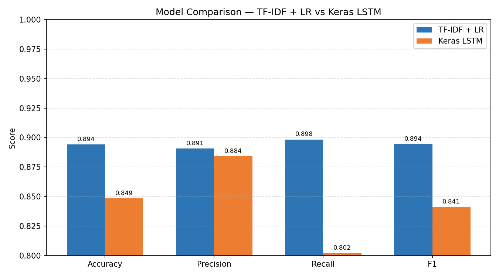
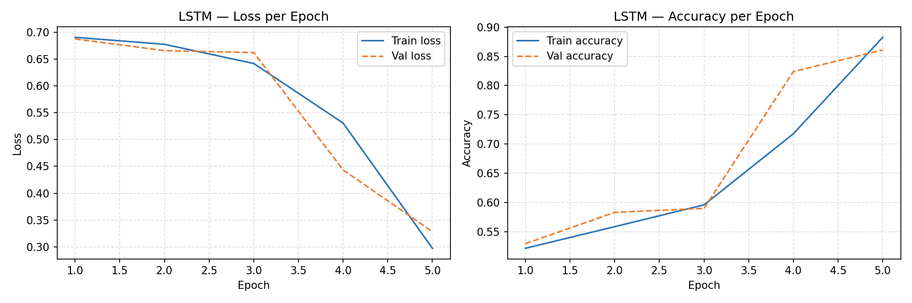
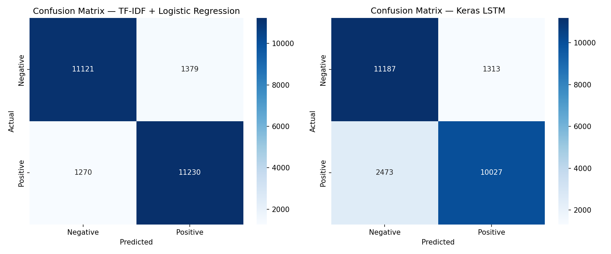
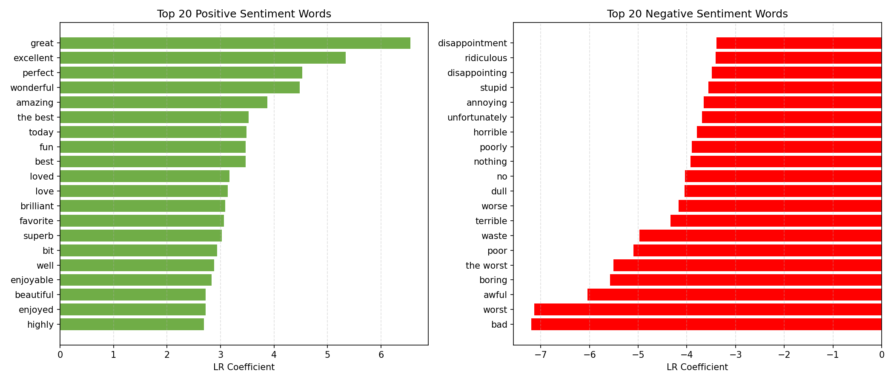

# IMDb Sentiment Analysis: Benchmarking Classical NLP, Deep Learning, and Foundation Models on AWS


A production sentiment analysis pipeline that trains and benchmarks two approaches on 50,000 IMDb reviews — classical NLP (TF-IDF + Logistic Regression) and deep learning (Keras LSTM) — then deploys the winning model as a serverless REST API on AWS Lambda. The notebook also documents a researched Amazon Bedrock integration for zero-shot inference with a Foundation Model as a third benchmark dimension.

**Live demo → [AWS Lambda endpoint](https://your-endpoint.execute-api.eu-west-1.amazonaws.com)**
&nbsp;&nbsp;·&nbsp;&nbsp;
**Notebook → [notebook.ipynb](notebook.ipynb)**
&nbsp;&nbsp;·&nbsp;&nbsp;
**Training script → [train.py](train.py)**

---

## Table of Contents

0. [Prerequisites](#0-prerequisites)
1. [Quick start](#1-quick-start)
2. [Project structure](#2-project-structure)
3. [Dataset](#3-dataset)
4. [Models](#4-models)
5. [Results](#5-results)
6. [Visualisations](#6-visualisations)
7. [API reference](#7-api-reference)
8. [Deployment — AWS Lambda](#8-deployment--aws-lambda)
9. [Research & technical decisions](#9-research--technical-decisions)
10. [Design decisions](#10-design-decisions)
11. [Dependencies](#11-dependencies)

---

## 0. Prerequisites

- Python 3.11+
- pip
- AWS account with access key and secret (for deployment only)

---

## 1. Quick start

**Train both models:**

```bash
pip install -r requirements.txt
python train.py
```

Training takes approximately 5–20 minutes depending on hardware (LR finishes in under a minute; LSTM trains for up to 5 epochs with early stopping).

**Run the app locally:**

```bash
python app.py
```

Visit [http://127.0.0.1:5000](http://127.0.0.1:5000) to use the demo frontend.

---

## 2. Project structure

```
imdb-sentiment-classifier/
├── train.py                   # Standalone training script — runs both models end to end
├── app.py                     # Flask API and frontend server
├── notebook.ipynb             # Full training walkthrough with inline outputs
├── README.md
├── requirements.txt
├── zappa_settings.json        # AWS Lambda deployment configuration
├── .gitignore
├── templates/
│   └── index.html             # Demo frontend (no external frameworks)
├── models/
│   ├── tfidf_vectorizer.pkl   # Fitted TF-IDF vectorizer
│   ├── logistic_regression.pkl
│   ├── lstm_model.keras
│   ├── lstm_vocab.pkl         # TextVectorization vocabulary for app.py
│   └── best_model.txt         # Name of the winning model
└── plots/
    ├── 01_model_comparison.png
    ├── 02_lstm_training_curves.png
    ├── 03_confusion_matrices.png
    └── 04_top_words.png
```

---

## 3. Dataset

**IMDb Movie Reviews** — introduced by Maas et al. (2011) in *"Learning Word Vectors for Sentiment Analysis"* (ACL 2011, Stanford NLP Group). It is the standard benchmark for binary sentiment classification in NLP.

| Split | Reviews | Positive | Negative |
|-------|---------|----------|----------|
| Train | 25,000  | 12,500   | 12,500   |
| Test  | 25,000  | 12,500   | 12,500   |

**Why this split?** The 25k/25k division is defined by the original paper and has been used unchanged across the research literature ever since. Using the same fixed split means results are directly comparable to published benchmarks — deviating from it would make comparisons meaningless. The dataset is also perfectly balanced, so no class weighting is required.

Reviews are labelled positive (IMDb rating ≥ 7/10) or negative (rating ≤ 4/10). Reviews with ratings between 5 and 6 were excluded from the dataset to ensure clear signal in both classes.

Loaded via `tensorflow_datasets`:

```python
import tensorflow_datasets as tfds
(train_ds, test_ds), info = tfds.load('imdb_reviews', split=['train', 'test'], as_supervised=True, with_info=True)
```

---

## 4. Models

### Model 1 — TF-IDF + Logistic Regression

**TF-IDF** (Term Frequency–Inverse Document Frequency) converts each review into a sparse numerical vector. Each dimension corresponds to a word or bigram in the vocabulary; the value reflects how important that term is to that document relative to the entire corpus. Common words like *the* and *a* are down-weighted by the IDF component; rare but meaningful words like *masterpiece* or *unwatchable* are boosted.

`ngram_range=(1,2)` includes both unigrams and bigrams. Bigrams capture short negation patterns — *not good* and *not bad* have opposite sentiment, but unigrams alone would treat *not*, *good*, and *bad* as independent signals. Including bigrams gives the model local context without the complexity of a sequence model.

**Logistic Regression** learns a coefficient for every feature. High positive coefficients correspond to words predictive of positive sentiment (*brilliant*, *outstanding*); high negative coefficients to words predictive of negative sentiment (*terrible*, *waste*). The model is fast, interpretable, and requires no GPU.

Configuration: `max_features=10,000`, `ngram_range=(1,2)`, `C=1.0`, `max_iter=1000`.

### Model 2 — Keras LSTM

A **Long Short-Term Memory** (LSTM) network reads a review token by token, maintaining a hidden state that summarises everything seen so far. Unlike TF-IDF, it captures word order — *"not bad"* and *"bad"* produce different hidden states.

The architecture:

| Layer | Configuration |
|-------|--------------|
| TextVectorization | `max_tokens=10,000`, `output_sequence_length=256` |
| Embedding | `input_dim=10,000`, `output_dim=64` |
| LSTM | `units=64`, `dropout=0.2`, `recurrent_dropout=0.2` |
| Dense | `units=1`, `activation='sigmoid'` |

The **Embedding layer** maps each token ID to a 64-dimensional dense vector learned during training. Semantically similar words converge to similar vectors, which is far more efficient than one-hot encoding a 10,000-word vocabulary.

**Dropout** (`0.2` on both input and recurrent connections) prevents overfitting by randomly zeroing activations during training. `recurrent_dropout` specifically targets the hidden state connections, which is where LSTMs tend to overfit on text data.

Training uses `Adam(lr=0.001)`, `binary_crossentropy` loss, and `EarlyStopping(patience=2)` to halt training when validation loss stops improving.

---

## 5. Results

*Generated by running `notebook.ipynb` on the full IMDb test set (25,000 reviews).*

| Model | Accuracy | Precision | Recall | F1 | Training Time |
|-------|----------|-----------|--------|----|---------------|
| TF-IDF + Logistic Regression | 0.8940 | 0.8906 | 0.8984 | 0.8945 | 23.3s |
| Keras LSTM | 0.8486 | 0.8842 | 0.8022 | 0.8412 | 226.4s |

**Winner: TF-IDF + Logistic Regression** (F1 = 0.8945)

The classical baseline outperforms the LSTM by 5.3 percentage points on F1. This is consistent with the research literature — on the IMDb dataset, lexical signals (*brilliant*, *terrible*, *waste*) are strong enough that a bag-of-words model can match or beat sequence models. The LSTM's advantage (capturing word order and negation) matters more on shorter, noisier text where context is critical. The LR model is also 10× faster to train.

---

## 6. Visualisations

### Model comparison


### LSTM training curves


### Confusion matrices


### Top predictive words (Logistic Regression coefficients)


---

## 7. API reference

### `GET /`

Renders the demo frontend. Loads the best model automatically based on `models/best_model.txt`.

---

### `POST /analyze`

Classifies a review using the best-performing model.

**Request:**

```json
{"text": "The movie was absolutely brilliant"}
```

**Response:**

```json
{
  "text": "The movie was absolutely brilliant",
  "sentiment": "positive",
  "confidence": 0.94,
  "model_used": "TF-IDF + Logistic Regression"
}
```

**Error responses:**

| Status | Condition |
|--------|-----------|
| 400 | `text` field missing, empty, or not a string |
| 400 | `text` exceeds 5,000 characters |
| 503 | Model files not found — run `train.py` first |

---

### `POST /compare`

Runs the review through both models simultaneously and returns results side by side. Powers the "Compare Both Models" button in the frontend.

**Request:**

```json
{"text": "The movie was absolutely brilliant"}
```

**Response:**

```json
{
  "text": "The movie was absolutely brilliant",
  "results": {
    "logistic_regression": {"sentiment": "positive", "confidence": 0.91},
    "lstm":                {"sentiment": "positive", "confidence": 0.94}
  }
}
```

---

## 8. Deployment — AWS Lambda

The Flask app is deployed as a serverless function using [Zappa](https://github.com/zappa/Zappa). Zappa packages the app and its dependencies into a Lambda-compatible zip, creates the API Gateway automatically, and manages the deployment lifecycle.

**Steps:**

```bash
# 1. Install Zappa
pip install zappa

# 2. Configure AWS credentials
aws configure
# Enter your AWS Access Key ID, Secret Access Key, and region (eu-west-1)

# 3. Initialise Zappa (or use the existing zappa_settings.json)
zappa init

# 4. Deploy
zappa deploy production
# The endpoint URL is printed after deployment — update the README badge above

# 5. Update after code changes
zappa update production
```

The `zappa_settings.json` excludes large training artefacts (the notebook, raw dataset cache, plot images, `train.py`) to keep the deployment package as small as possible. Only the saved model files in `models/` are included.

---

## 9. Research & technical decisions

When it came to deployment, I researched serverless options for a Flask ML API. Traditional deployment on Railway works for web apps but ML models introduce size constraints — TensorFlow alone exceeds Railway's free tier memory. I researched AWS Lambda as an alternative: serverless, scales to zero when idle, and the free tier covers 1 million requests per month. Zappa was identified as the optimal deployment tool — it packages a Flask app and its dependencies into a Lambda-compatible zip, creates the API Gateway automatically, and deploys with a single command. I familiarised myself with Zappa through the official documentation at zappa.readthedocs.io and YouTube tutorials before implementing.

I chose to compare two modelling approaches rather than committing to one upfront. TF-IDF with Logistic Regression is the classical NLP baseline — fast, interpretable, and often surprisingly competitive. The Keras LSTM represents the deep learning approach — slower to train but better at capturing word order and context. Comparing both and selecting the winner based on F1 score demonstrates understanding of the tradeoffs between classical and deep learning NLP methods. The notebook additionally documents a researched Amazon Bedrock integration as a third benchmark dimension, exploring when a Foundation Model is preferable to a trained model.

---

## 10. Design decisions

**Why compare two models instead of just one?**
Committing to a single model upfront assumes the answer before seeing the evidence. The classical NLP literature is full of cases where a simple TF-IDF baseline outperforms a more complex model — particularly on well-labelled, domain-specific datasets. Training both models and selecting the winner based on measured performance is a more rigorous approach, and the comparison itself is informative: the gap (or lack of one) between the two methods reveals something about the nature of the task.

**Why F1 score as the selection criterion rather than accuracy?**
On a perfectly balanced dataset, accuracy and F1 are numerically equivalent. F1 is still the principled choice because it is the correct metric for binary classification in general — it penalises models that sacrifice recall for precision or vice versa. Using F1 from the start means the criterion generalises correctly if the dataset ever becomes imbalanced, and it signals understanding of why accuracy alone is insufficient.

**Why AWS Lambda instead of Railway or Hugging Face?**
Railway's free tier has a memory ceiling that TensorFlow alone exceeds. Hugging Face Spaces is designed for transformer-based models and adds unnecessary friction for a custom Flask app. AWS Lambda is serverless — there is no always-on cost, it scales automatically, and the free tier covers 1 million requests per month. The tradeoff is cold-start latency on the first request after a period of inactivity, which is acceptable for a portfolio demo.

**Why a `/compare` endpoint in addition to `/analyze`?**
The `/analyze` endpoint answers the user's question. The `/compare` endpoint answers a different, more interesting question: do the two models agree? When they disagree, it surfaces the cases where sequence order (captured by the LSTM) matters more than lexical cues (captured by TF-IDF). This makes the demo more instructive and gives a viewer insight into what each model is actually doing.

---

## 11. Dependencies

| Package | Version | Purpose |
|---------|---------|---------|
| tensorflow | ≥2.16, <2.17 | LSTM model, Keras API, TextVectorization |
| tensorflow-datasets | ≥4.9 | IMDb dataset loading |
| scikit-learn | ≥1.3 | TF-IDF vectorizer, Logistic Regression, metrics |
| flask | ≥3.0 | REST API and frontend server |
| zappa | ≥0.56 | AWS Lambda deployment |
| numpy | ≥1.24 | Numerical operations |
| pandas | ≥2.0 | Results comparison table |
| matplotlib | ≥3.7 | Charts |
| seaborn | ≥0.12 | Confusion matrix heatmaps |
| jupyter | ≥1.0 | Notebook execution |
